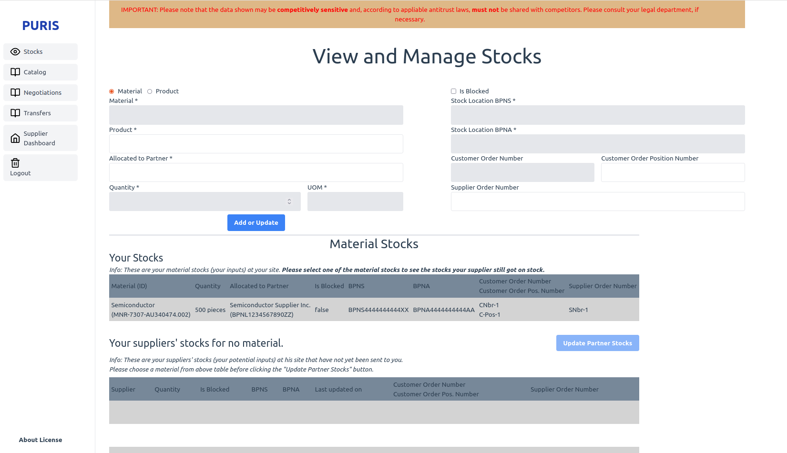
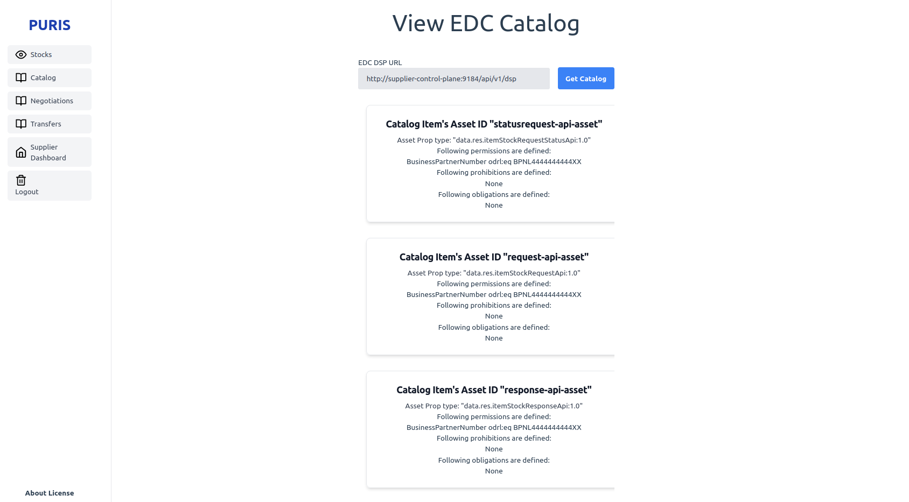
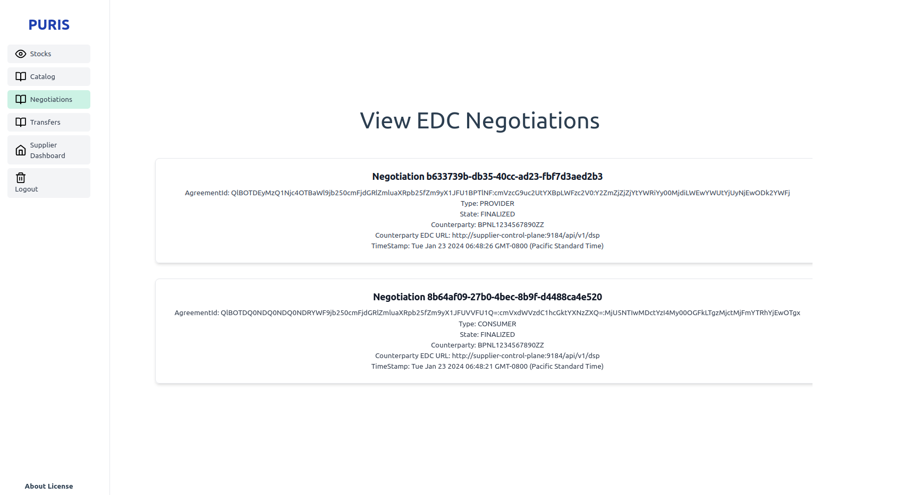
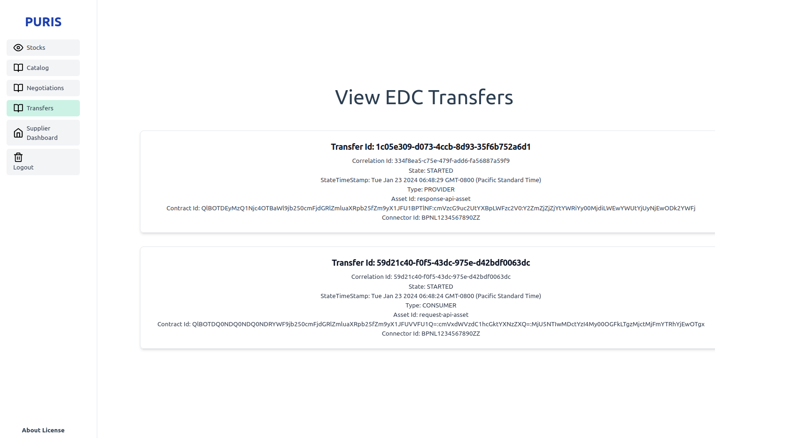

# User Guide

This guide explains the overall masks that may be used by different roles.

- A `PURIS_USER` may see use views "View and Manage Stocks" and "Supplier Dashboard".
- A `PURIS_ADMIN` may _additionally_ use the views "Catalog", "Negotiations" and "Transfers".

In the following the views are explained.

Note: A user may additionally log out or see license information of the application.

## View and Manage Stocks

This view allows a user to either create material or product stocks and allocate them to a partner. Stocks always need
to be allocated to a partner due to potential multi-sourcing scenarios.

The view is divided horizontally into three parts:

1. Create or Update Material / Product Stocks
2. Material Stocks
3. Product Stocks

### Create or update Material / Product Stocks

The view allows a user to either add a material (user selected radio button 'Material') or a product
(user selected radio button 'Product'). The user then

1. Either selects a Material or Product.
2. Sets the partner who will receive (Product) or from whom one received (Material) the stock.
3. Sets a quantity that is on stock with a selected unit of measurement (UOM).
4. Whether the stock is blocked or not (e.g. quality assurance ongoing).
5. The stocks location based on a Site (BPNS) and a corresponding Address (BPNA).
6. Optionally adds a reference to order positions.

The updated or created stocks can be seen in the related section after triggering button "Add or Update".

### Material Stocks

The table shows the relevant information regarding all material stocks that are at your sites. The user may select one
stock to see which of the selected material are already allocated on supplier side. Using the button "Update Partner
Stocks", the user may request an update of this data for all partners who supply the material.
Note: Stock information is updated asynchronously. The user may reload the page later to see the updated data.

### Product Stocks

The table shows the relevant information regarding all product stocks that are at your sites. The user may select one
stock to see which of the selected products have already arrived on customer side but not be used for production. Using
the button "Update Partner Stocks", the user may request an update of this data for all partners who buy the material.
Note: Stock information is updated asynchronously. The user may reload the page later to see the updated data.

## Supplier Dashboard

The Supplier Dashboard is a preview. It allows a partner to select a customer, material and location information to
get insights regarding the current status of a customers' supply situation. Using the button "Update Customer Data", the
respective information for the partner get updated.
Note: information is updated asynchronously. The user may reload the page later to see the updated data.

## Catalog

An admin may use the page to query offers available at a partner to check if the partner set up the information exchange
for this partner.

After entering a valid data space protocol (DSP) address of a partner and triggering the "Get Catalog" button, the user
may see a list of available assets.

Per Catalog Item the following information is listed:

- Asset ID
- Asset Prop Type defining the asset type (close to CX Taxonomy)
- Permissions (Contracts)
- Prohibitions (Contracts)
- Obligations (Contracts)

Note: Only catalog items / offers that can be accessed by you are listed.

## Negotiations

An admin may use the page to see all recent negotiations and their state.

If no negotiation has been performed in the EDC yet, then this view is empty as in the picture above.

Per Negotiation the following information is listed:

- Negotiation ID
- Type (have I been acting as a Data `PROVIDER` or Data `CONSUMER`?)
- State of the negotiation
- Partner BPNL who either
    - initiated the negotiation (Type = `PROVIDER`) or
    - who I asked to negotiate with (Type = `CONSUMER`)
- Partner's EDC DSP endpoint
- TimeStamp when the state of the negotiation has been set

_**Note**: Per data request per partner, there are two Negotiations as one contracts the partner's request asset and the
partner contracts your response asset._

## Transfers

An admin may use the page to see all recent transfers and their state.

If no transfer has been performed in the EDC yet, then this view is empty as in the picture above.

Per Transfer the following information is listed:

- Transfer ID
- Correlation ID indicating the `Transfer ID` on partner site
- State of the negotiation
- TimeStamp when the state of the negotiation has been set
- Type (have I been acting as a Data `PROVIDER` or Data `CONSUMER`?)
- Asset ID that has been contracted
- Contract ID that has been the basis of the Transfer
- Partner BPNL who either
    - initiated the negotiation (Type = `PROVIDER`) or
    - who I asked to negotiate with (Type = `CONSUMER`)

_**Note**: Per data request per partner, there are two Transfers as one contracts the partner's request asset and the
partner contracts your response asset._
